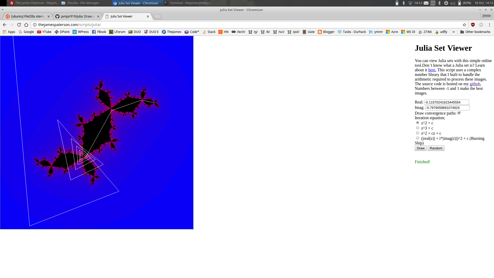

# Julia

Draw pretty julia sets. To run, extract to some folder, and run index.html. A live version is provided on my site, thejamespaterson.com, [here.](http://thejamespaterson.com/scripts/julia)

Has support for drawing convergence lines, which is pretty neat, as well as drawing some other types of Julia fractals, like the ones from the burning ship fractal. Now with zoom functionality! Press right click, and select an area to zoom into it.
